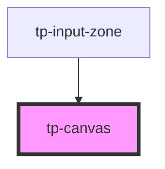

# tp-canvas

<!-- Auto Generated Below -->

## Properties

| Property | Attribute | Description | Type          | Default     |
| -------- | --------- | ----------- | ------------- | ----------- |
| `height` | `height`  |             | `number`      | `600`       |
| `hostEl` | --        |             | `HTMLElement` | `undefined` |
| `width`  | `width`   |             | `number`      | `1000`      |

## Methods

### `exportDrawing() => Promise<unknown>`

#### Returns

Type: `Promise<unknown>`

## Dependencies

### Used by

 - [tp-input-zone](../tp-input-zone)

### Graph

----------------------------------------------

*Built with [StencilJS](https://stenciljs.com/)*
