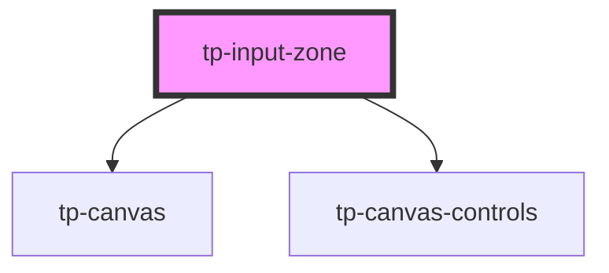

# tp-input-zone

<!-- Auto Generated Below -->

## Properties

| Property        | Attribute        | Description | Type     | Default     |
| --------------- | ---------------- | ----------- | -------- | ----------- |
| `buttonColor`   | `button-color`   |             | `string` | `undefined` |
| `round`         | `round`          |             | `number` | `undefined` |
| `selectedColor` | `selected-color` |             | `string` | `undefined` |

## Dependencies

### Depends on

- [tp-canvas](../tp-canvas)
- [tp-canvas-controls](../tp-canvas-controls)

### Graph

----------------------------------------------

*Built with [StencilJS](https://stenciljs.com/)*
